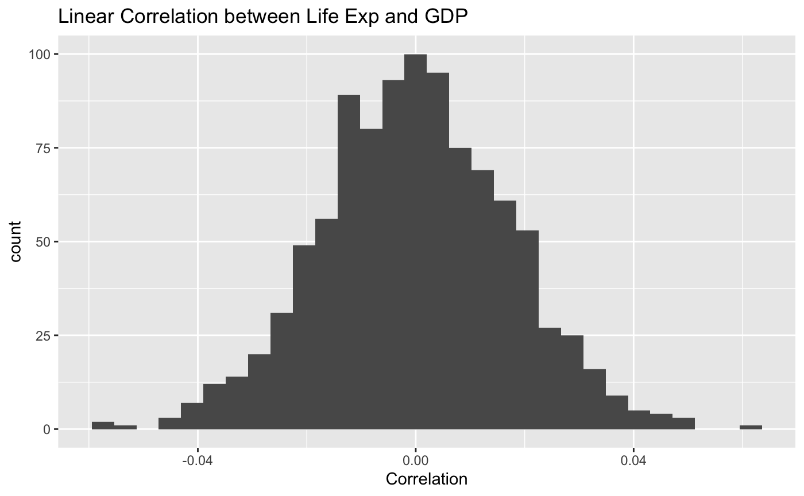

```{r setup, include=FALSE}
knitr::opts_chunk$set(echo = TRUE, message = F, warning = F)

library(tidyverse)
library(forcats)
library(gapminder)

mydata <- gapminder_unfiltered
```
# Lab 12

## Briefly describe the gapminder dataset.

The gapminder is a dataset that charts data such as life exp, population, and gdp for most countries in the world. This data is recodered for each year form 1950 to 2007.
  * country 
  * continent 
  * year 
  * lifeExp - life expectancy at birth 
  * pop - total population 
  * gdpPercap - per-capita GDP (per-capita GDP (Gross domestic product) is given in units of international dollars)

# Q1 - What is the difference between the life expectancy between Japan and Sweden?
## Why is this question are important?
These questions are important in order to figure out how to best increase the life expentancy of a certian country. THis is important because everyone wants to life longer.

## Two-sample mean permutation test.
```{r, eval = F}
perm_mean <- function(perms = 1000, all_values, n_A) {
  ## Variables ##
  # perms: The number of permutations 
  # all_values (num): all data values
  # n_A (int): Size of group A
  ###############
  
  # Step 1:
  # Create vector of zeroes of length "perms" to store
  # permuted mean differnces
  perm_mean_diffs <- numeric(perms)
  
  # Loop throught number of permutations
  for(i in c(1:perms)) {
    # Step 2:
    # Randomly separate vector "values" into disjoint 
    # groups of size "nA" and "nB" respectively
    rand_order <- sample(all_values)
    group_A <- rand_order[1:n_A]
    group_B <- rand_order[(n_A+1):length(all_values)]
    
    # Step 3:
    # Compute the sample means for the two groups from 
    # step 2
    A_bar <- mean(group_A)
    B_bar <- mean(group_B)
    
    
    # Step 4: 
    # Compute the difference in sample means, store the
    # value in the vector from step 1
    diff_means <- A_bar - B_bar
    perm_mean_diffs[i] <- diff_means
    
  }
  
  # Step 5:
  # Return the permuted mean differences vector
  return(perm_mean_diffs)
  
}
```

## Run Two-sample mean permutation test.
```{r}
mydata_filterd <- mydata %>% filter(country == "Japan" | country == "Sweden")
mydata_one <- mydata %>% filter(country == "Japan")
mydata_two <- mydata %>% filter(country == "Sweden")

mean_one <- mean(mydata_one$lifeExp)
mean_two <- mean(mydata_two$lifeExp)
mean_tot_dif <- mean_two - mean_one
#mean_per <- perm_mean(1000, mydata_filterd$lifeExp, length(mydata_one$lifeExp))
mean_tot_dif
```

## Graph Two-sample mean permutation test.

```{r}
#ggplot(data.frame(mean_per), aes(mean_per)) + geom_histogram() + labs(title = "Permuation Mean Differince between China and United Kingdom", x = "Mean Difference")
```


## Conclusion based on Two-sample mean permutation test.
I belive that there is minium difference's between Japan and Sweden's life expency. The majority of the mean differeance is situated around 0, thus meaning that there is very little difference bewteen the two contries life Exp.

## Generate percentiles, summary statistics (max, min), and probabilites (p-values) to justify your conclusions.
We can justify our conclusion, because the mean difference between Life Expectancy in Japan vs. Sweden is only a difference of about 1.5 years (sweden having the larger life expectancy), meaning they are esentially equal in terms of country health


# Is there a corrilation between life expectancy and gpd?

## Why is this question are important?
These questions are important in order to figure out how to best increase the life expentancy of a certian country. THis is important because everyone wants to life longer.

## Explain why your questions are important. One of the questions should be answered with the two-sample mean permutation test, and the other with the correlation permutation test.
These questions are important in order to figure out how to best increase the life expentancy of a certian country. THis is important because everyone wants to life longer.

## Correlation permutation test.
```{r, eval = F}
perm_cor <- function(perms, x, y) {
  ## Variables ##
  # perms: The number of permutations 
  # x: Vector of Variable 1 - for computing correlation
  # y: Vector of Variable 2 - for computing correlation
  ###############
  
  # Step 1:
  # Create vector of zeroes of length "perms" to store
  # permuted mean differnces
  corrs <- numeric(perms)
  
  # Loop throught number of permutations
  for (i in c(1:perms)) {
    # Step 2:
    # Randomly mix up the values in the vector "y"
    randY <- sample(y)
    
    # Step 3:
    # Compute the correlation between x and the randomly mixed
    # up y-vector. Store this value in the vector from step 1.
    corrs[i] <- cor(x, randY)
  }
  
  # Step 4:
  # Return new updated vector, created in step 1
  return(corrs)
  
}
```

## Run Correlation permutation test.
```{r}
#cor <- perm_cor(1000, mydata$lifeExp, mydata$gdpPercap)
```

## Graph Correlation permutation test.
```{r}
#ggplot(data.frame(cor), aes(cor)) + geom_histogram() + labs(title = "Linear Correlation between Life Exp and GDP", x = "Correlation")
```


## Conclusion based on Correlation permutation test.
There is a linear correlation between life exp and the gdp due the bell curve.

```{r}
#actual_cor <- cor(mydata$gdpPercap, mydata$lifeExp)

#cor_mydata <- tibble(correlation = perm_cor(perms = 1000, mydata$gdpPercap, #mydata$lifeExp))

#(percentile_cor <- nrow(filter(cor_mydata, correlation <= actual_cor))/1000 * 100)

#actual_cor
```


## Generate percentiles, summary statistics (max, min), and probabilites (p-values) to justify your conclusions.
We calculated that the actual correlation between life expectancy and GDP per capita from the data set is 0.63. Due to the extremity of this value, we reject the null hypothesis. It makes logical sense that there would be a strong positive correlation between GDP and life expectany due to the nature of macro-economics, and therefore our data supports this claim.


## Team Report

**Tyler:** I made the perm_cor function. I did this by first making a correlation vector full of 0's based on the number of inputted perms. Then I go into the for loop and in the for loop I first shuffle the Y vector and then find the correlation of X and the shuffled Y. I then take that correlation value and store it into spot "i" of the vector of correlations. I then return the vector of correlations

**Trent:** I found the relevent data value to support our conclusions, as well as formatted the lab

**Logan:** Ploted the graphs, and then the conclusion based on test. 

**Joe**  I assisted creating the perm_cor function. I also answered a couple misc. questions throughout the lab.

**Jack: ** I Helped create group plots as well as helped make the write up
