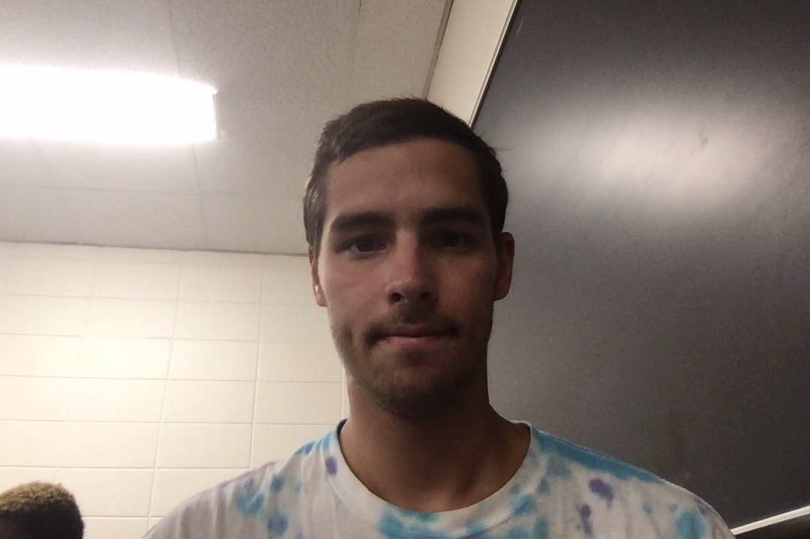
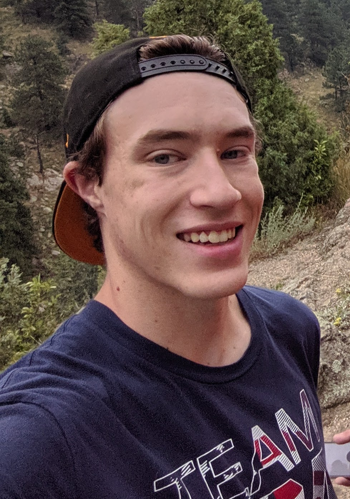

```{r setup, include=FALSE}
knitr::opts_chunk$set(echo = TRUE)
```

## About Team


* Our team goal for this class is to work together. Also we wish to learn R as a team, so that by the end of the semester everyone (not just one or two) will know how to probally use R and RStudio for Data Science. 

## About Joe


* Why do males tend to consolidate to the weight-lifting section of the gym and the females to the cardio section?
* Six months after graduation, I hope to be celebrating my 24th birthday at the very latest. I think that my life is still to young to be predicting a career path. however, I would be happy if five years after my graduation I was traveling the world or working an adventurous, active job. It would be unfortunate if I found myself in an office space doing grunt work.
* I want to be happy and financially stable. That's pretty much the goal.
* I think that this course will provide valuble insight into a field of work that is rapidly expanding and has been recommended to me by multiple people for the past couple months. I'm excited to see what this class holds for me.
* Guess the lie: (a) I am a trained elephant caretaker  (b) I once won an international aerospace design competition  (c) I appeared in two Nerf Blasters comercials as a child.

## Joe's Feedback
* Jack: I am very interested to learn that you are on the cheer team! That is really cool! I am also interested in learning R so that I can use it in the future.
* Tyler: I am also curious about persuing data science as a career. I think that it's cool that we get to explore data science as a team this year.
* Trent: I think it's cool that you and I share the same career goal, enjoying our jobs. I think it's awesome that you have your horizons that open!
* Logan: I think that your career path is super interesting. AI is the future and the fact that you seem so determined to work in that field is awesome!

## About Jack


* I would like to be able to see how much it takes to run music festivals
* 6 months after I graduate I hope to have a job in the data science field and/or be travelling. At 5 years I would hope to still have a job and work my way up the data science ladder, and I would be excited to continue learning about new things in the data science world.
* I wouldn't really know what my greatest career accomplishment would be other than to keep a job or maybe even start something on my own relating to probability and data science.
* I would really like to learn R and be able to use it to help better myself and gain more knowledge in the data science field.
* Im on the cheer team at CU and like to snowboard in the winter.

### Jack's Feedback
* Joe- I like Joe's reference to the weight room. Maybe you could add how some females are very fond of weight training although you are correct in the vast majority being more cardio focused.
* Tyler- I am also big into skiing/longboarding. You could maybe add what type of career you would like to team lead.
* Trent- I like how he is into movies. Your responses are concise, but maybe you could elaborate more on what marketing expenses you might be referring to.
* Logan- Very interesting take on the dog image idea. You could maybe add more details and how data would come more into play with the dog idea.

## About Tyler


 * I would like to be able to see how much movies make based on budget and actors.
 * 6 months after I graduate I would like to be looking for a job and exploring for what to do with my degree.  At 5 years I would like to be working in a field that relates to by degree that I enjoy
 * I hope to lead a team in my career or be some kind of a manager/lead for a company. 
 * In this course I hope to learn what data science is so I can see if I want to choose it as my major.
 * I really enjoy movies, skiing, and longboarding

### Tyler's Feedback
 * Joe - I really like how Joes did a 2 truths and a lie for something interesting about him.
 * Jack -  I think everything about Jack's goals and interests is fair, although I would like to know more about his career interests.
 * Trent -  I like how trent also enjoys movies. I feel he could add what his favorite movie is.
 * Logan - I like how interested Logan is in AI, I would like to know why he's so interested in AI.

## About Trent


 * Similar to Tyler, I would also be interested in applying data science to film, but more specifically on marketing and expenses of films.
 * 6 months after I graduate I hope to be at somr sort of start up position at a company I like, and at 5 years I would like to hopefully be at the same job, or on a steady career path.
 * I'm not sure if I have a specific goal for my "greatest career accomplishment" yet, but I hope it will ultimatly be something fufilling that I enjoy doing.
 * In this course, I hope to learn about how to apply data science knowledge that we learn to tangible data sets, as well as learn new tools to work with data (R).
 * I am also a bit of a cinefile (favorite movies: Back to the Future and The Thing), and I enjoy skiing and roller coasters

### Trent's Feedback
 * Joe: I think you did a good job outlining your personal goals, and I liked how you chose the "two truths one lie" format to share some interesting facts. The only thing I would say needs expanding upon is your gym related statistical section. A few more details would help flesh that out.
 * Jack: I respect how honest you were in some of your answers, especially regarding your greatest career accomplishment. The only thing I think you shoudld expand on is why you want to work with data from music festivals specifically.
 * Tyler: I think your goals are well said, especially considering you are still choosing a major. Maybe some more details about why you have an interest in management would add some insight to your business-related interests.
 * Logan: I like how your goals for the future are very specific, which clearly shows your passion for coding and AI. I think a few more details regarding the dog breed analization could help explain why and how you want to accomplish this. 

## About Logan


 * By analyzing data, i would like to know the what breed a dog is based on an image.
 * Six mounths after graduation I will love to be working as a prgramer working on AI. After 5 years, I would like to be doing the same thing just getting paid more.
 * I would like my greatest career accomplishment to work an AI that is significantly more advance then current AI's. 
 * I would like to learn the basics of data science, since data science is a big part of machine learning. 
 * I would love to work on the AI that lands rockets, seen by Space X.
 
### Logan's Feedback

* Joe: I like that for your interesting fact you choosed had us guess the lie. Not to sure which one is the lie but each one is very cool.
* Jack: I like how your goals are very resonable, however I would like to know more specifically about said goals.
* Tyler: I think that your question about movie's profit vs. movie's buget was an intriguing question.
* Trent: I like how his career goals are rational. I think if you elaborated more about the his question about marketing of films since I did not find this very clear.

Note that the `echo = FALSE` parameter was added to the code chunk to prevent printing of the R code that generated the plot.
