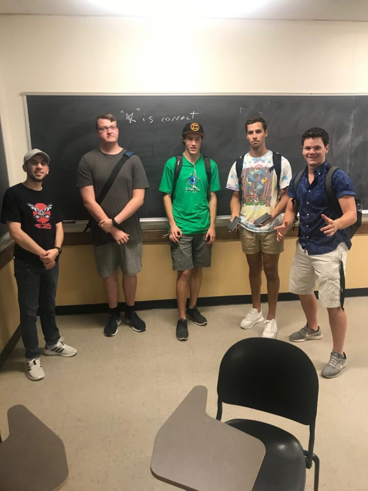

```{r setup, include=FALSE}
knitr::opts_chunk$set(echo = TRUE)
```

## Team Details
* Team Name - Spicy Bois

* Photo
* Want to Accomplish?

## About Joe

## About Jack

## About Tyler
 * I would like to be able to see how much movies make based on budget and actors.
 * 6 months after I graduate I would like to be looking for a job and exploring for what to do with my degree.  At 5 years I would like to be working in a field that relates to by degree that I enjoy
 * I hope to lead a team in my career or be some kind of a manager/lead for a company. 
 * In this course I hope to learn what data science is so I can see if I want to choose it as my major.
 * I really enjoy movies.

## About Trent
 * Similar to Tyler, I would also be interested in applying data science to film, but more specifically on marketing and expenses of films.
 * 6 months after I graduate I hope to be at somr sort of start up position at a company I like, and at 5 years I would like to hopefully be at the same job, or on a steady career path.
 * I'm not sure if I have a specific goal for my "greatest career accomplishment" yet, but I hope it will ultimatly be something fufilling that I enjoy doing.
 * In this course, I hope to learn about how to apply data science knowledge that we learn to tangible data sets, as well as learn new tools to work with data (R).
 * I am also a bit of a cinefile, and I enjoy skiing and roller coasters

## About Logan


 * By analyzing data, i would like to know the what breed a dog is based on an image.
 * Six mounths after graduation I will love to be working as a prgramer working on AI. After 5 years, I would like to be doing the same thing just getting paid more.
 * I would like my greatest career accomplishment to work an AI that is significantly more advance then current AI's. 
 * I would like to leans the basics of data science, since data science is a big part of machine learning. 
 * I would love to work on the AI that lands rockets, seen by Space X.

Note that the `echo = FALSE` parameter was added to the code chunk to prevent printing of the R code that generated the plot.
